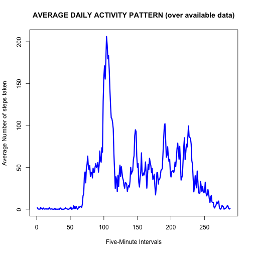

# REPRODUCIBLE RESEARCH -- PROJECT 1
## Gian Balsamo

### INTRODUCTION
This study makes use of data from a personal activity monitoring device that collects data at 5 minute intervals through out the day. The dataset analysed in this study consists of two months of data from an anonymous individual collected during the months of October and November, 2012 and includes the number of steps taken in 5 minute intervals each day.
The variables included in this dataset are:
1. steps: Number of steps taking in a 5-minute interval (missing values are coded as NA)
2. date: The date on which the measurement was taken in YYYY-MM-DD format
3. interval: Identifier for the 5-minute interval in which measurement was taken.
This study documents step-by-step the R code used in manipulating the dataset, and reports all relevant results. Each section's title makes evident either the section's goal or the main statistical question it is meant to answer.

### Loading and preprocessing the data


Load and read data:


```r
library(ggplot2)
library(dplyr)
```

```
## 
## Attaching package: 'dplyr'
## 
## The following objects are masked from 'package:stats':
## 
##     filter, lag
## 
## The following objects are masked from 'package:base':
## 
##     intersect, setdiff, setequal, union
```

```r
library(lattice)
fileUrl<-"https://d396qusza40orc.cloudfront.net/repdata%2Fdata%2Factivity.zip"
##if(!file.exists('./project_1')) {dir.create('./project_1')}
download.file(fileUrl, destfile='./activity.zip',method='curl')
unzip('./activity.zip', exdir='./')
data <- read.csv("./activity.csv", header = TRUE, colClasses = c("numeric", "character","integer"))
data_wholes<-data[complete.cases(data),]
```

### What is the mean total number of steps taken per day?
The following code makes some basic computations:


```r
somme<-aggregate(steps~date,data=data_wholes,sum)
average<-mean(somme$steps) 
mediana<-median(somme$steps)
```

The mean total number of steps taken per day is 1.0766189 &times; 10<sup>4</sup>.   
The median total number of steps taken per day is 1.0765 &times; 10<sup>4</sup>.  

The following histogram shows the total number of steps taken each day:


```r
hist(somme$steps, main = "Total steps taken each day (over available data)", xlab = "Range of steps", col = "red", breaks=pretty(0:22000, n=10))
```

 

### What is the average daily activity pattern?
The following code executes various data manpulations.


```r
data_by_5_mins<-group_by(data_wholes,interval)
average_by_interval<-summarize(data_by_5_mins,avg=mean(steps))
names(average_by_interval)<-c("interval","average_steps")
top_index<-which.max(average_by_interval$average_steps)
top_interval<-average_by_interval[top_index,"interval"]
max_avg_steps<-average_by_interval[top_index,"average_steps"]
```

The following time-series plot shows the average number of steps taken on each 5-minute interval, averaged across all days (y-axis). As the x-axis indicates, there are 288 5-minute intervals in 24 hours.  


```r
plot(x=1:288,y=average_by_interval$average_steps,type="l", xlab="Five-Minute Intervals", ylab="Average Number of steps taken", main="AVERAGE DAILY ACTIVITY PATTERN (over available data)",lwd=3,col="blue")
```

 

On average, the maximum number of steps occurs in the interval whose ordinal number, among all 288 5-minute intervals, is 104.  
Its value in the dataset is 835, which indicates that on average, the maximum number of steps is taken at 8:35 A. M.  

### Imputing Missing Values
The following code executes essential data manipulations.


```r
NaDataSet<-data[!complete.cases(data),]
totMissingValues<-length(NaDataSet[,1])
NaDataSet[,"steps"]<-average_by_interval[,"average_steps"]
data[!complete.cases(data),"steps"]<-NaDataSet[,"steps"]
newSomme<-aggregate(steps~date,data=data,sum)
newAverage<-mean(newSomme$steps)
newMediana<-median(newSomme$steps)
```

The total number of missing values in the dataset is 2304.  

In order to fill in all of these missing values, I have substituted the NA's with the mean value for their corresponding 5-minute interval.  
From this new dataset, it results that the mean and median total number of steps taken per day are 1.0766189 &times; 10<sup>4</sup> and 1.0766189 &times; 10<sup>4</sup>.  
In other words, the mean and median total number of steps taken per day are both the same as the mean total number of steps taken per day as measured by the originally available data (see above). You may recall that, from the original database, the median total number of steps taken per day resulted to be 1.19 steps smaller than the mean.  

The following histogram shows the total number of steps taken each day according to the new dataset.  


```r
hist(newSomme$steps, main = "Total steps taken each day (over available and imputed data)", xlab = "Range of steps", col = "red", breaks=pretty(0:22000, n=10))
```

 

One can adopt several alternative options in order to impute missing data on the estimates of the total daily number of steps. As explained above, the approach reflected in the above graph consists of substituting the NA's with the available mean value for their corresponding 5-minute interval.  
The benefits of this approach are basically irrelevant, as can be immediately seen from a comparison between the above histogram and the analogous previous histogram, which used only the originally available data.

### Are there differences in activity patterns between weekdays and weekends?  

The following code separates weekdays from weekends, using the originally available dataset.  


```r
data$date<-as.Date(data$date)
data<-mutate(data,day="NA")
weekend<-weekdays(data$date)=="Saturday" | weekdays(data$date)=="Sunday"
data$day[weekend]<-"weekend"
data$day[!weekend]<-"weekday"
data2Feriale<-data[data$day=="weekday",]
data2Festivo<-data[data$day=="weekend",]
data2FerialeBis<-group_by(data2Feriale,interval)
data2FestivoBis<-group_by(data2Festivo,interval) 
medieFeriale<-mutate(data2FerialeBis,average=mean(steps))
medieFestivo<-mutate(data2FestivoBis,average=mean(steps))
medieBoth<-rbind(medieFeriale[1:288,],medieFestivo[1:288,])
medieBothBis<-cbind(medieBoth,c(1:288,1:288))
names(medieBothBis)<-c("steps","date","interval","day","average","ordinal_interval")
```

The following panel plot contains a time series plot of the 5-minute interval (x-axis) and the average number of steps take, averaged across all weekday days or weekend days (y-axis). 


```r
xyplot(average~ordinal_interval|day,type="l",data=medieBothBis, xlab="5-minute Interval" ,ylab="Number of Steps",lwd=3,layout=c(1,2))
```

 

The following code calculates the 5-minute interval when motion is at its peak on weekday days.


```r
peak_time<-medieFeriale$interval[which.max(medieFeriale$average[1:288])]
```

For the subject under study, it is evident that motion, when measured in terms of steps taken, is more intense and better distributed on weekend days that on weekday days.  
However, the peak of his/her motion is reached in the morning of weekday days, precisely at the 5-minute interval whose value is 835, i.e., at 8:35 A. M.  

